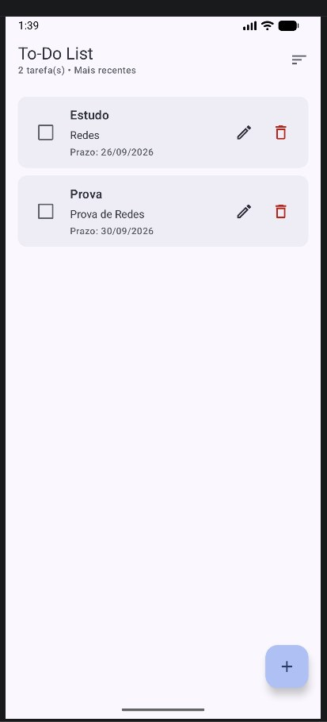

# Evidências — confirmação de exclusão

Esta sequência registra o comportamento de exclusão de tarefas no aplicativo.

## 1. Lista antes da exclusão

A tarefa que será utilizada no teste ainda está presente na lista.

## 2. Solicitação de exclusão

Ao tocar no ícone de lixeira, o aplicativo exibe um diálogo de confirmação com as ações **Cancelar** e **Excluir**.

## 3. Cancelamento da exclusão

Após selecionar **Cancelar**, o diálogo é fechado e a tarefa permanece na lista.

## 4. Nova solicitação de exclusão

Ao tocar novamente no ícone de lixeira, o diálogo de confirmação é exibido novamente.

## 5. Exclusão confirmada

Após selecionar **Excluir**, somente a tarefa escolhida é removida da lista.

